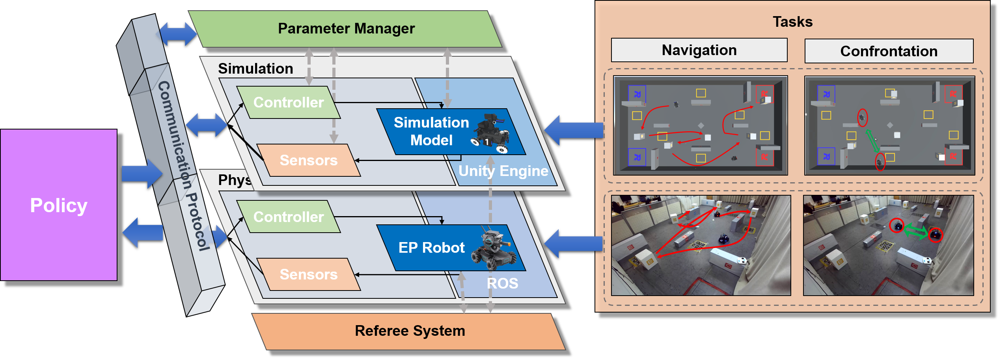
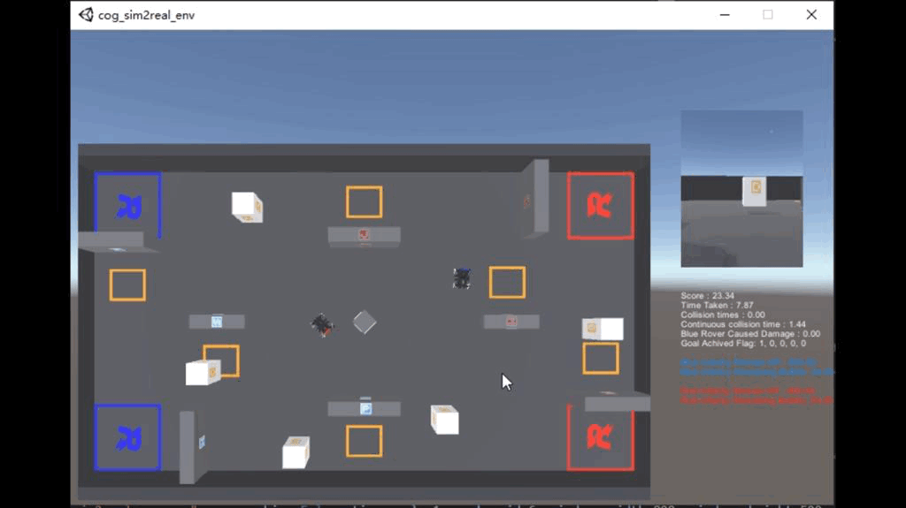
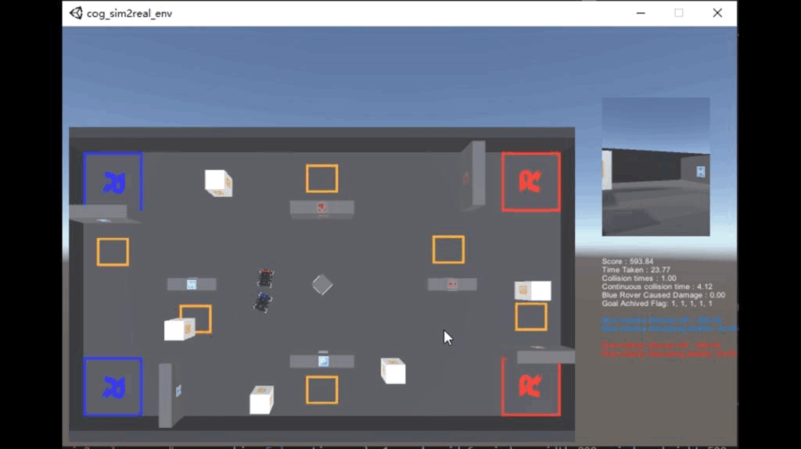
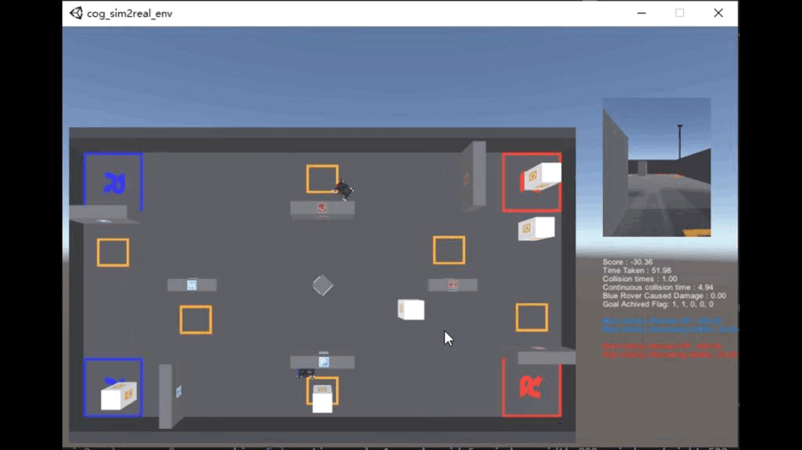
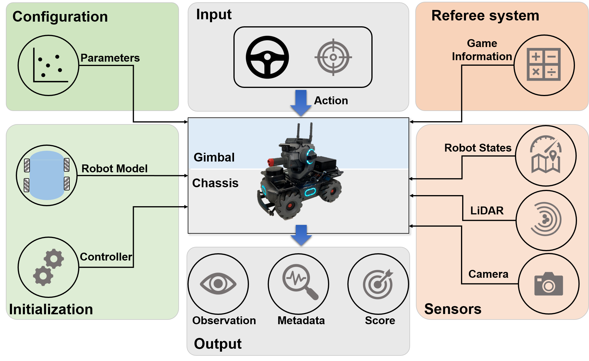

# NeuronsGym

## NeuronsGym: A Hybrid Framework and Benchmark for Robot Tasks with Sim2Real Policy Learning

Haoran Li, Mingjun Ma, Shasha Liu, Guangzheng Hu, Yaran Chen and Dongbin Zhao

***
NeuronsGym is a new hybrid framewrok that can be used for policy learning of robot tasks, covering a simulation platform that can be used for training policy, and a physical system for studying sim2real problems. 

***
## Framework Overview


***
### Tasks

<!-- |               |navigation | confrontation | combination |
|:---:          |:---:      |:---:          |:---:|
|**simulation** |       |       |       |
|**reality**    |       |       |       | -->

<table>
    <tr>
        <td></td>
        <td align="center">Navigation</td>
        <td align="center">Confrontation</td>
        <td align="center">Combination</td>
    </tr>
    <tr>
        <td>Simulation</td>
        <td></td>
        <td></td>
        <td></td>
    </tr>
    <tr>
        <td>Reality</td>
        <td></td>
        <td></td>
        <td></td>
    </tr>
</table>
<!-- <center class="half">
    
    
</center> -->

***
### Simulation Platform

We build the simulation platform based on Unity3D to train agent policies. This simulation platform includes the arena required by different tasks, the simulation robot models and their required controllers, and a variety of sensors. The simulators can be found in the release page.

#### Environment 
|Component|Requirement|
|   ---   |    ---    |
|OS       | Ubuntu 16.04+ |
|Python   | Versions 3.6+|
#### Installation
- Step 1: Download the simulator from the lastest releases.

Currently we have only released environments that support linux systems, including for navigation tasks, confrontation tasks, combined tasks, and evaluation environments.

- Step 2: Install the dependencies the environment API.

We recommend that you use `conda` or `virtualenv` to create a clean python standalone environment.
If you use `conda`, you can create a new environment by
```
conda create -n neuronsgym_env python=3.8
```
If you use `virtualenv`, youcan create a new environment by
```
virtualenv -p python3.8 neuronsgym_env
source neuronsgym_env/bin/active
```
Next, you need to install some dependency packages.
```
pip install -r requriements.txt
```
- Step 3: Install the environment API.
```
pip install cogenvdecoder
```
#### Examples
We have provided some code examples to make it easier for users to understand and use this simulation platform.

```
env = CogEnvDecoder(env_name="envs/cog_sim2real_env.x86_64", no_graphics=False, time_scale=1, worker_id=2, seed=1234, force_sync=True)
# env_name: path of the simulator
# no_graphics: should use headless mode [Warning: if no_graphics is True, image if invalid!]
# time_scale: useful for speedup collecting data during training, max value is 100
# worker_id: socket port offset, useful for multi-thread training
# seed: random seed for generate position of the goals and the robots
# force_sync: use time synchronization (True) or not (False)

observation = env.reset(fri_cor=0.1, KP=8, KI=0, KD=2, VK1=0.375, M=3.4, Wheel_I=0.0125)
# fir_cor: friction factor
# KP, KI, KD: parameters of PID
# VK1: parameter of the motor(M3508I)
# M: the mass of the robot
# Wheel_I: the inertia of the wheel

action = env.action_space.sample()
# action = [vx, vy, vw, fire]; vx: the velocity at which the vehicle moves forward [-2.0, 2.0], vy: the velocity at which the vehicle moves to the left[-2.0, 2.0], vw: Angular speed of the vehicle counterclockwise rotation [-pi/4, pi/4.0], fire: Shoot or not

obs, reward, done, info = env.step(action)
```
For more information about `obs`, see the `check_state()` function in `Simulation/api_test.py`

In addition, we also provide code templates for users to develop agents for easier transfer to physical platforms. The code templates are shown in `Simulation/agent_test.py`

In this template, we recommend users to encapsulate the algorithm functions into the `agent_control()` function and obey the `agent_control()` function interface. This function is shown in `Simulation/simple_agent.py`.

***
### Physical Platform

Physical platform includes an arena with $8.0m \times 4.5m$ size and physical robot. The layout of the arena is borrowed from the RoboMaster University AI Challenge. We use the infantry of RoboMaster EP as the robot platform.

<center>
    
</center>


#### Environment
| Hardwares|
|---|
|RoboMaster EP|
|RPLiDAR S2|
|Nvidia Jetson NX|

|Component|Requirement|
|   ---   |    ---    |
|JetPack  | 4.6.1     |
|OS       | Ubuntu 18.04 |
|Python   | Versions 3.6+|
|ROS1      | Melodic |


#### Installation
- Step 1: Install the required dependency libraries.
```
sudo apt-get install -y ros-melodic-cv-bridge                         \
						ros-melodic-image-transport        \
						ros-melodic-map-server                  \
						ros-melodic-laser-geometry          \
						ros-melodic-interactive-markers \
						ros-melodic-tf                                       \
						ros-melodic-pcl-*                                \
						ros-melodic-libg2o                             \
						ros-melodic-rplidar-ros                    \
						ros-melodic-rviz                                  \
						protobuf-compiler                              \
						libprotobuf-dev                                   \ 
						libsuitesparse-dev                              \
						libgoogle-glog-dev                             \
```

- Step 2: Fix the LIDAR on the robot and install the LIDAR driver.
```
sudo apt-get install -y ros-melodic-rplidar-ros
```
Remember to obtain read and write permissions for the USB port every time you reboot the computing platform or plug in the LiDAR USB port.
```
sudo chmod 777 /dev/ttyUSB0
```
More about the RPLiDAR can be found [here](http://wiki.ros.org/rplidar).

- Step 3: Compile localization node and point cloud distortion correction nodes.
```
cd RealRobot/ep_ws
catkin_make
```

- Step 4: Install the RoboMaster driver.
We recommend using virtualenv to create a virtual environment.
```
virtualenv -p python3.6 neuronsgym_env
pip install robomaster
```
Remember to obtain read and write permissions for the robot USB port every time you reboot the computing platform or the robot, or plug in the robot USB port.
```
sudo chmod 777 /dev/ttyACM0
```
#### Examples
Once you have configured your environment, you are ready to test your bot. First you need to start the bot test node.
```
cd RealRobot/python
python baseline_test.py
```
Then start the ROS node.
```
cd RealRobot/ep_ws
source devel/setup.bash
roslaunch ep_bringup ep_localization.launch
```

If the nodes all start properly, you can check the localiztion while opening `rviz`. Then use `rviz` to give the robot the correct initial pose.

Once everything is ready, you can press `s` in the terminal where the python program is executed, and the robot will execute the agent policy
***
### Support
If you encounter any issues while using NeuronsGym, please open an issue on GitHub.

***
### Citation
If you use NeuronsGym, please cite the original NeuronsGym paper:

***
### Acknowledgement
We are very grateful to Xiaofei Bing and Lingze Zeng for their contributions in this project.
***
### License
MIT License